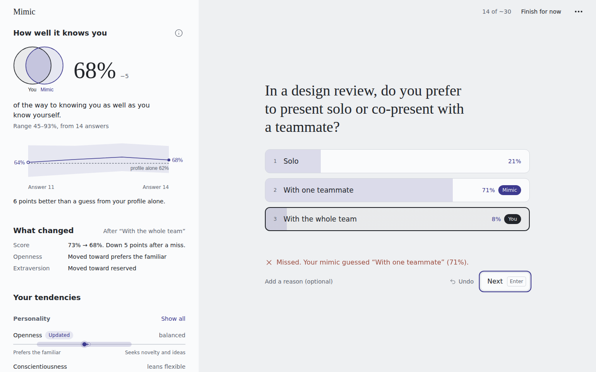
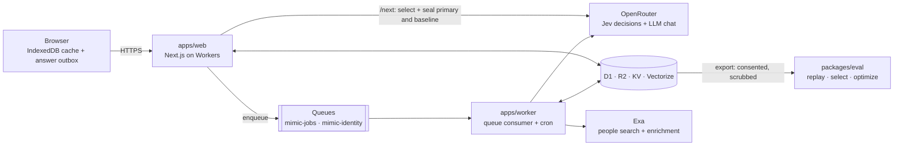

# Mimic

**Learns how you decide from as few as 30 questions, and scores every guess before you answer.**



<sub>Local <code>pnpm dev</code> run with live providers. The answers came from a script, so the numbers shown are not a result.</sub>

## Overview

- **Problem.** LLM "digital twins" of people often barely beat a guess from demographics alone, and grading them on their own training data inflates their scores.
- **Approach.** Every question is a typed decision (`choice`, `yes/no` or a 5-point `score`). Before the person answers, a decision model (TypeSafe Jev, `typesafe/jev-1.13`) predicts a distribution over the options from a sealed state that holds only earlier answers. Five cheap LLMs make the same prediction as shadows.
- **Result so far.** The pipeline works end to end: a live 30-question session made 416 model calls for **$0.09** in total, and replay rebuilt 100% of the pinned sealed states. There are no findings on real people yet. All measured runs used scripted answers ([docs/VALIDATION.md](docs/VALIDATION.md)).

## Key features

| Feature | What you get |
| --- | --- |
| Sealed, prequential scoring | Each prediction is stored with a `stateHash` before the answer arrives, so the headline number is an honest held-out estimate. |
| A baseline on every question | A profile-only prediction runs on every question, so you see the lift over "a guess from your profile alone". |
| Fidelity relative to you | Accuracy divided by your own consistency on repeated questions: "predicts you X% as well as you predict yourself". |
| Value-of-information selection | Each question is picked for what it teaches the mimic: uncertain, conflicting or weak facets, plus coverage and answer burden ([docs/SELECTION.md](docs/SELECTION.md)). |
| Predictor bake-off | Jev plus 5 LLM shadows on the same sealed states. `/lab` shows accuracy, log loss, Brier, ECE, $/1k and latency. |
| Portable, deletable output | Download `mimic.json` (schema `mimic/1`) or a curated `SOUL.md` for your own agents. Hard delete covers D1, R2, Vectorize and KV. |

## Architecture



| Component | Role |
| --- | --- |
| `apps/web` | UI and the synchronous path: serves each question with its sealed primary and baseline predictions, then scores the answer. |
| `apps/worker` | Async jobs: identity search, question generation, shadow predictions, learning (traits, insights, knowledge graph) and snapshots. |
| `packages/core` | The pure TypeScript engine (state, selection, scoring, fidelity), shared by both apps and the CLI. |
| `packages/eval` | Offline CLI: export consented data, replay, simulate selection and optimize prompts. |

<details>
<summary>Tech stack</summary>

| Layer | Choice |
| --- | --- |
| Runtime | Cloudflare Workers; Next.js 16 via `@opennextjs/cloudflare` |
| Storage | D1 (Drizzle ORM), R2, KV, Vectorize, Queues, Workers AI embeddings |
| Client | React 19, Tailwind 4, TanStack Query persisted to IndexedDB, zod at every boundary |
| Models | `typesafe/jev-1.13` (primary). Shadows: GPT-6 Luna, DeepSeek V4.1 Flash, GLM 5.3 Flash, MiMo V2.6 Flash, Qwen3.8 Flash. Generator and reflector: DeepSeek V4.1 Flash. All via OpenRouter. |
| Tooling | pnpm 10, Turborepo, TypeScript 5.9 (strict), Biome, Vitest (+ `@cloudflare/vitest-pool-workers`) |

</details>

## Quickstart

Requires Node ≥ 22.12, pnpm 10 and an [OpenRouter](https://openrouter.ai) API key. No Cloudflare account is needed locally.

```bash
git clone https://github.com/punitarani/mimic.git && cd mimic
pnpm i
cp apps/web/.dev.vars.example apps/web/.dev.vars && cp apps/worker/.dev.vars.example apps/worker/.dev.vars
# set OPENROUTER_API_KEY in both .dev.vars files
pnpm dev
```

Open **http://localhost:3000/new?invite=mimic-dev**. Run `pnpm check` (lint, typecheck, tests) before every commit.

[CONTRIBUTING.md](CONTRIBUTING.md) covers every environment variable, the other commands and the rules PRs are held to.

## Deploy

Mimic runs on Cloudflare Workers. There is no Docker image. One idempotent command creates the resources, runs the
migrations, deploys both Workers, puts `/lab` behind Cloudflare Access and smoke-tests the result:

```bash
doppler run -- pnpm deploy:prod
```

[docs/DEPLOY.md](docs/DEPLOY.md) lists the secrets, token scopes and preview setup.

> [!WARNING]
> `pnpm dev` treats every visitor as an admin (`DEV_MODE=1`). Never expose it to the internet. Deployed sign-up needs an invite code, and provider keys never reach the browser.

## Project structure

```
mimic/
├── apps/
│   ├── web/          # Next.js UI + route handlers (sync path)
│   └── worker/       # Queue consumer + cron (async jobs)
├── packages/
│   ├── core/         # Pure TS engine: configs, prompts, selection, scoring, fidelity
│   ├── adapters/     # Provider clients + recorded fixtures
│   ├── db/           # Drizzle schema, migrations, Store, R2/KV/Vectorize helpers
│   └── eval/         # Offline eval + optimization CLI
├── docs/             # Spec (PLAN), decisions (ADRs), design notes, validation log, ontology, prompts
└── scripts/          # Dev orchestrator, egress relay, backfill, deploy
```

## Research and references

Four questions ([PLAN §1](docs/PLAN.md)): does Jev beat cheap LLMs per dollar (RQ1)? Which selector reaches a target fidelity in the fewest questions (RQ2)? Do reflection and a knowledge graph add fidelity, or only stereotype (RQ3)? Which LLM gives the best fidelity per dollar as generator and reflector (RQ4)?

| Design decision | Why | Source |
| --- | --- | --- |
| Report lift over a profile-only baseline | Rich twins often barely beat demographic personas and drift toward stereotypes | Peng, Toubia et al. 2025, [arXiv:2509.19088](https://arxiv.org/abs/2509.19088) |
| Divide by self-consistency | Test–retest accuracy caps what any twin can reach (81.7% on Twin-2K-500) | Toubia et al. 2025, [arXiv:2505.17479](https://arxiv.org/abs/2505.17479) |
| Evidence over description in `SOUL.md` | Interview-based agents: 0.85 normalized accuracy, vs. 0.70–0.71 from demographics or a persona paragraph | Park et al. 2024, [arXiv:2411.10109](https://arxiv.org/abs/2411.10109) |
| BALD / value-of-information selection | Asks where plausible readings of you disagree, not where answers are just noisy | Houlsby et al. 2011; Han 2018 ([PMC5968224](https://www.ncbi.nlm.nih.gov/pmc/articles/PMC5968224/)) |
| Answer latency is a signal | Response time tracks strength of preference | Konovalov & Krajbich 2019 |
| GEPA prompt optimization | Reflective prompt evolution needs a few hundred metric calls, not thousands | Agrawal et al. 2025, [arXiv:2507.19457](https://arxiv.org/abs/2507.19457) |

Findings so far. These are about the models and the pipeline, not about people:

- Jev is not bit-for-bit deterministic across calls, so replay compares within a tolerance.
- Run-to-run noise per question is 0.031 nats for Jev and 0.14–0.20 for DeepSeek V4.1 Flash, which makes Jev the cheaper optimization target.

Every design decision is logged as an ADR in [docs/DECISIONS.md](docs/DECISIONS.md).

## License and contributing

- **License:** none yet. No `LICENSE` file is checked in, so default copyright applies.
- **Contributing:** see [CONTRIBUTING.md](CONTRIBUTING.md).

## Citation

If you use Mimic, please cite the repository ([CITATION.cff](CITATION.cff)):

```bibtex
@software{arani_mimic_2026,
  author = {Arani, Punit},
  title  = {Mimic: Efficient Human Mimicry},
  year   = {2026},
  url    = {https://github.com/punitarani/mimic}
}
```
