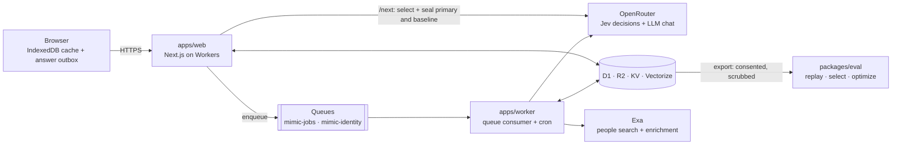

# Mimic

**Learns how you decide from about 30 quick questions, and scores every guess before you answer.**

[](https://github.com/punitarani/mimic/actions/workflows/ci.yml)


<sub>Local <code>pnpm dev</code> run with live providers. The answers came from a script, so the numbers shown are not a result.</sub>

## Overview

- **Problem.** LLM "digital twins" of people often barely beat a guess from demographics alone, and grading them on their own training data inflates their scores.
- **Approach.** Every question is a typed decision (`choice`, `yes/no` or a 5-point `score`). Before the person answers, a decision model (TypeSafe Jev, `typesafe/jev-1.13`) predicts a distribution over the options from a sealed state that holds only earlier answers. Five cheap LLMs make the same prediction as shadows.
- **Result so far.** The pipeline works end to end: a live 30-question session made 416 model calls for **$0.09** in total, and replay rebuilt 100% of the pinned sealed states. There are no findings on real people yet. All measured runs used scripted answers ([docs/VALIDATION.md](docs/VALIDATION.md)).

## Key features

| Feature | What you get |
| --- | --- |
| Sealed, prequential scoring | Each prediction is stored with a `stateHash` before the answer arrives, so the headline number is an honest held-out estimate. |
| A baseline on every question | A profile-only prediction runs on every question, so you see the lift over "a guess from your profile alone". |
| Fidelity relative to you | Accuracy divided by your own consistency on repeated questions: "predicts you X% as well as you predict yourself". |
| Value-of-information selection | Each question is picked for what it teaches the mimic: uncertain, conflicting or weak facets, plus coverage and answer burden ([docs/SELECTION.md](docs/SELECTION.md)). |
| Predictor bake-off | Jev plus 5 LLM shadows on the same sealed states. `/lab` shows accuracy, log loss, Brier, ECE, $/1k and latency. |
| Portable, deletable output | Download `mimic.json` (schema `mimic/1`) or a curated `SOUL.md` for your own agents. Hard delete covers D1, R2, Vectorize and KV. |

## Architecture



| Component | Role |
| --- | --- |
| `apps/web` | UI and the synchronous path. `POST /next` serves a pooled question with its sealed primary and baseline predictions (target p50 ≤ 800 ms). `POST /answers` stores and scores the answer. |
| `apps/worker` | Async jobs: identity search, question generation (`pool.refill`), shadow predictions, learning (trait reads, reflection, KG), snapshots. Cron requeues stale jobs and refreshes item stats. |
| `packages/core` | Pure TypeScript engine: configs, state builder, selectors, scoring, fidelity. No Cloudflare, Next or Node imports, so the same code runs in both apps and the CLI. |
| `packages/adapters` | OpenRouter chat, Jev decisions, Exa, Parallel, Perplexity and embeddings. Tested against recorded fixtures. |
| `packages/db` | Drizzle schema, migrations and the `Store`, plus R2, KV and Vectorize helpers. |
| `packages/eval` | Node CLI: export, replay, selection simulation, Twin-2K-500 import, reports and GEPA-style prompt optimization. |

<details>
<summary>Tech stack</summary>

| Layer | Choice |
| --- | --- |
| Runtime | Cloudflare Workers; Next.js 16 via `@opennextjs/cloudflare` |
| Storage | D1 (Drizzle ORM), R2, KV, Vectorize, Queues, Workers AI embeddings |
| Client | React 19, Tailwind 4, TanStack Query persisted to IndexedDB, zod at every boundary |
| Models | `typesafe/jev-1.13` (primary). Shadows: GPT-6 Luna, DeepSeek V4.1 Flash, GLM 5.3 Flash, MiMo V2.6 Flash, Qwen3.8 Flash. Generator and reflector: DeepSeek V4.1 Flash. All via OpenRouter. |
| Tooling | pnpm 10, Turborepo, TypeScript 5.9 (strict), Biome, Vitest (+ `@cloudflare/vitest-pool-workers`) |

</details>

## Quickstart (local)

**Prerequisites:** Node ≥ 22.12, pnpm 10 (`corepack enable`), and an [OpenRouter](https://openrouter.ai) API key. No Cloudflare account is needed: D1, R2, KV and Queues run locally in Miniflare.

```bash
git clone https://github.com/punitarani/mimic.git && cd mimic
pnpm i
cp apps/web/.dev.vars.example apps/web/.dev.vars && cp apps/worker/.dev.vars.example apps/worker/.dev.vars
# set OPENROUTER_API_KEY (and optionally EXA_API_KEY) in both .dev.vars files
pnpm dev
```

Open **http://localhost:3000/new?invite=mimic-dev**. The worker runs on http://localhost:8787. `pnpm dev` applies migrations and copies any missing `.dev.vars` from the example.

Configuration lives in `apps/web/.dev.vars` and `apps/worker/.dev.vars` (gitignored). There is no `.env` file. The templates are [`apps/web/.dev.vars.example`](apps/web/.dev.vars.example) and [`apps/worker/.dev.vars.example`](apps/worker/.dev.vars.example).

| Variable | Needed? | Purpose |
| --- | --- | --- |
| `OPENROUTER_API_KEY` | **Yes** | Jev, the LLMs and embeddings |
| `EXA_API_KEY` | For web search | Identity search and enrichment. Without it, untick "Search the public web" on `/new`, or use the fixtures below. |
| `SEARCH_PROVIDER`, `ENRICH_PROVIDER` | No | `fixture` for an offline identity demo with fictional people; `none` to disable |
| `PARALLEL_API_KEY`, `PERPLEXITY_API_KEY` | No | Alternative enrichment and search providers |
| `INVITE_CODES` | Web only | Comma-separated invite codes (dev: `mimic-dev`) |
| `SESSION_SECRET` | Web only | Signs the participant cookie. Change it outside local dev. |
| `ADMIN_EMAILS` | Web only | Who may open `/lab` |
| `EGRESS_RELAY` | Keep as is | Routes provider calls through a local relay (`scripts/egress-relay.mjs`, ADR-0002) |
| `DEV_MODE` | Local only | Opens `/lab`, and every mimic, to any visitor. The deploy preflight refuses it. |

<details>
<summary>Other commands</summary>

```bash
pnpm check            # lint + typecheck + test; no live provider calls
pnpm test:live        # live smoke tests (LIVE=1, needs keys)
pnpm eval -- --help   # export | replay | select | import | report | session | evaluate | diagnose | optimize
pnpm eval -- export --env local --out data/x.sqlite   # consented mimics only, PII scrubbed
pnpm backfill --predictor <id>                        # run a new predictor on questions already served
```

</details>

## Self-host / deploy

There is no Docker setup. Mimic targets Cloudflare Workers, and one idempotent command provisions and deploys everything: D1, R2, KV, Queues, Vectorize, both Workers, migrations, the Access policy for `/lab`, and a smoke test.

```bash
pnpm deploy:dry-run                 # rehearsal (CI's build job): OpenNext build + wrangler --dry-run; no credentials
doppler run -- pnpm deploy:prod     # real deploy; secrets come from Doppler (or plain env vars)
```

| Required | Value |
| --- | --- |
| `CLOUDFLARE_API_TOKEN`, `CLOUDFLARE_ACCOUNT_ID` | Token scopes are listed in [docs/DEPLOY.md](docs/DEPLOY.md) |
| `APP_URL` | Your custom domain, e.g. `https://mimic.example.com` |
| `OPENROUTER_API_KEY`, `SESSION_SECRET` | `openssl rand -base64 32` for the secret |
| `INVITE_CODES`, `ADMIN_EMAILS` | Cohort invite codes; admins allowed into `/lab` |

Optional settings: `SEARCH_PROVIDER`, `ENRICH_PROVIDER`, `EMBEDDINGS_PROVIDER`, `VECTOR_BACKEND`, `BUDGET_USD` (default $1 per mimic) and `BUDGET_SESSION_SHARE` (default 0.8).

**Security basics**

- Keys stay server-side. The browser never calls a provider, and preflight prints secret names, never values.
- Sign-up needs an invite code. `/lab` sits behind Cloudflare Access plus `ADMIN_EMAILS`.
- Preview deploys on `workers.dev` without Access, so its lab stays closed.
- Never expose a `DEV_MODE=1` server (such as `pnpm dev`): it treats every visitor as an admin.
- A spend cap per mimic refuses model calls once it is reached.

CD (`.github/workflows/cd.yml`) deploys `main` after green CI. See [docs/DEPLOY.md](docs/DEPLOY.md) for the full path.

## Project structure

```
apps/web/          Next.js UI + route handlers (sync path)
apps/worker/       Queue consumer + cron (async jobs)
packages/core/     Pure TS engine: configs, prompts, selection, scoring, fidelity
packages/adapters/ Provider clients + recorded fixtures
packages/db/       Drizzle schema, migrations, Store, R2/KV/Vectorize helpers
packages/eval/     Offline eval + optimization CLI
docs/              PLAN (spec), DECISIONS (ADRs), SELECTION, OPTIMIZATION, VALIDATION, DEPLOY, ontology, prompts
scripts/           Dev orchestrator, egress relay, backfill, deploy
```

## Research and references

Four questions ([PLAN §1](docs/PLAN.md)): does Jev beat cheap LLMs per dollar (RQ1)? Which selector reaches a target fidelity in the fewest questions (RQ2)? Do reflection and a knowledge graph add fidelity, or only stereotype (RQ3)? Which LLM gives the best fidelity per dollar as generator and reflector (RQ4)?

| Design decision | Why | Source |
| --- | --- | --- |
| Report lift over a profile-only baseline | Rich twins often barely beat demographic personas and drift toward stereotypes | Peng, Toubia et al. 2025, [arXiv:2509.19088](https://arxiv.org/abs/2509.19088) |
| Divide by self-consistency | Test–retest accuracy caps what any twin can reach (81.7% on Twin-2K-500) | Toubia et al. 2025, [arXiv:2505.17479](https://arxiv.org/abs/2505.17479) |
| Evidence over description in `SOUL.md` | Interview-based agents: 0.85 normalized accuracy, vs. 0.70–0.71 from demographics or a persona paragraph | Park et al. 2024, [arXiv:2411.10109](https://arxiv.org/abs/2411.10109) |
| BALD / value-of-information selection | Asks where plausible readings of you disagree, not where answers are just noisy | Houlsby et al. 2011; Han 2018 ([PMC5968224](https://www.ncbi.nlm.nih.gov/pmc/articles/PMC5968224/)) |
| Answer latency is a signal | Response time tracks strength of preference | Konovalov & Krajbich 2019 |
| GEPA prompt optimization | Reflective prompt evolution needs a few hundred metric calls, not thousands | Agrawal et al. 2025, [arXiv:2507.19457](https://arxiv.org/abs/2507.19457) |

Findings so far. These are about the models and the pipeline, not about people:

- Jev is not bit-for-bit deterministic across calls, so replay compares within a tolerance.
- Run-to-run noise per question is 0.031 nats for Jev and 0.14–0.20 for DeepSeek V4.1 Flash, which makes Jev the cheaper optimization target.
- With reasoning at low effort, Qwen3.8 Flash failed 78% of prod predictions. With reasoning off it answers in about 2 s (ADR-0038).

All 39 decisions are in [docs/DECISIONS.md](docs/DECISIONS.md).

## License and contributing

- **License:** none yet. No `LICENSE` file is checked in, so default copyright applies.
- **Contributing:** open a PR against `main`. Run `pnpm check` first, and add an ADR to [docs/DECISIONS.md](docs/DECISIONS.md) for any deviation from [docs/PLAN.md](docs/PLAN.md).

## Citation

If you use Mimic, please cite the repository ([CITATION.cff](CITATION.cff)):

```bibtex
@software{arani_mimic_2026,
  author = {Arani, Punit},
  title  = {Mimic: Efficient Human Mimicry},
  year   = {2026},
  url    = {https://github.com/punitarani/mimic}
}
```
